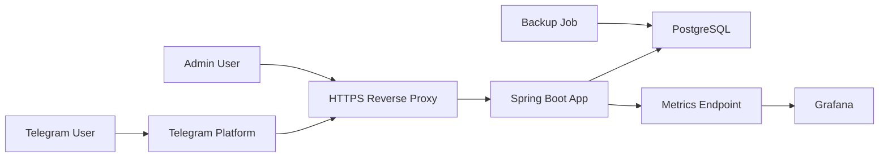

# Architecture Baseline

## Цель

Документ фиксирует решения этапа 0 из [requirements.md](/D:/Dev/projects/codex/split_us/requirements.md) и задает базу для этапа 1.

## Принятые решения

### 1. Backend

- Использовать монолит на `Spring Boot 2.7` и `Java 8`.
- Причина: стек совместим с доступной средой, позволяет быстро собрать webhook, внутренний API, Flyway, health-check и server-rendered админку без отдельного Node-контура.

### 2. Хранение данных

- Использовать `PostgreSQL 15`.
- Денежные значения хранить в минорных единицах (`BIGINT`, копейки), а не в `DECIMAL`.
- Причина: точная арифметика без ошибок округления на уровне хранения и расчета.

### 3. Telegram-интеграция

- Использовать webhook-вход через Spring MVC endpoint.
- Исходящие вызовы Telegram Bot API реализовывать тонким HTTP-клиентом поверх Spring, без тяжелого SDK.
- Причина: Bot API прост как HTTP JSON-контракт; это снижает связанность и упрощает контроль над webhook- и retry-поведением.

### 4. Админ-панель

- Реализовать отдельный web-интерфейс по префиксу `/admin` в том же backend-приложении.
- UI на `Thymeleaf`, без отдельного frontend build step.
- Причина: требование отдельного web-интерфейса соблюдается, при этом не требуется Node/toolchain, отсутствующий в текущей среде.

### 5. Безопасность

- HTTPS терминируется на reverse proxy `Nginx` на VDS.
- В webhook используется `X-Telegram-Bot-Api-Secret-Token`.
- Внутренний API аутентифицируется через отдельный `service token`.
- Админ-панель использует отдельную сессионную аутентификацию с хранением `bcrypt`-хеша пароля.

### 6. Развертывание

- Стартовая топология для MVP: один VDS, на нем reverse proxy, backend, PostgreSQL, Grafana.
- Развертывание контейнеризировано через `docker compose`.
- Причина: минимальная операционная сложность на раннем MVP.

### 7. Backup и восстановление

- Ежедневный `pg_dump` в архив на host volume.
- Хранение 7 дней с ротацией.
- Контрольное восстановление выполнять в отдельную временную БД на той же VDS до выхода в прод.
- Целевой RTO: до 1 часа, как указано в ТЗ.

### 8. Движок расчета

- Расчет выполняется после предварительной агрегации расходов в баланс участников в копейках.
- Для минимизации числа переводов используется exact search с перебором допустимых пар должник-кредитор и pruning.
- Решение признано spike-кандидатом, а не финальной production-реализацией, пока не будет пройден benchmark на лимитах MVP.

## Компонентная схема

## Технические последствия

- Монолит ускоряет этапы 1-5 и снижает накладные расходы на интеграцию.
- Хранение денег в копейках упрощает доказуемую корректность расчета и округления.
- Отсутствие отдельного JS toolchain делает админку менее гибкой визуально, но снижает риск на старте.
- Exact search по переводам остается главным техническим риском проекта: корректность достижима, но worst-case сложность требует операционных ограничений и benchmark.

## Следующий инкремент

1. Поднять backend-каркас.
2. Применить baseline-миграцию.
3. Закрыть draft OpenAPI.
4. Прогнать spike solver на граничных наборах балансов.
